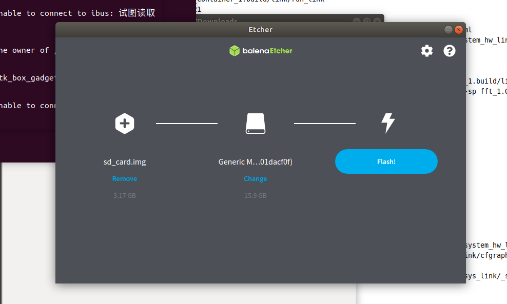

#利用vitis快速部署应用到ZCU104
本教程主要介绍利用vitis工具流将加速应用部署到ZCU104上，如图1所示是vitis工具流的概览。


##环境准备

###安装所需依赖
```
sudo apt-get install ocl-icd-libopencl1 opencl-headers ocl-icd-opencl-dev
sudo add-apt-repository ppa:xorg-edgers/ppa 
sudo apt-get update
sudo apt-get install libgl1-mesa-glx
sudo apt-get install libgl1-mesa-dri
sudo apt-get install libgl1-mesa-dev
sudo add-apt-repository --remove ppa:xorg-edgers/ppa
sudo apt install net-tools
sudo apt-get install -y unzip
sudo apt install gcc
sudo apt install g++
sudo apt install python
ln -s /usr/bin/python2 /usr/bin/python
sudo apt install putty
curl -1sLf \
   'https://dl.cloudsmith.io/public/balena/etcher/setup.deb.sh' \
   | sudo -E bash
sudo apt-get update
sudo apt-get install balena-etcher-electron
```
###下载安装vitis相关工具
1. [安装vitis软件](https://www.xilinx.com/support/download/index.html/content/xilinx/en/downloadNav/vitis.html)，这里下载的版本号最好要与之后下载相关内容保持一致。
	例如：这里下载了vitis2020.2，后续的软件和镜像最好也下载2020.2或者之前版本以保证兼容性。
2. [安装XRT软件](https://www.xilinx.com/products/design-tools/vitis/xrt.html#gettingstarted)，XRT是Xilinx FPGA的运行时库。
3. 配置环境
```
source /tools/Xilinx/Vitis/2020.2/settings64.sh
source /tools/Xilinx/Vitis_HLS/2020.2/settings64.sh
source /opt/xilinx/xrt/setup.sh
```
4. [下载ZCU104平台描述文件](https://www.xilinx.com/support/download/index.html/content/xilinx/en/downloadNav/embedded-platforms.html)，解压ZCU104平台描述文件，并将其复制到 `/opt/xilinx/platforms/` 下。
	ps：对于这里使用vitis 2020.2版本的同学来说，请选择2020.1版本的ZCU104平台描述文件。
	pss：2020.2版本的平台描述文件没有包含opencl domain，无法使用xrt方式运行并对PL编程。
5. [下载ZYNP平台通用镜像并解压](xilinx.com/support/download/index.html/content/xilinx/en/downloadNav/embedded-platforms/archive-vitis-embedded.html)，选择ZYNQMP common image。

6. ZYNP平台通用镜像展开，经过这个步骤，获得后续进行工程的镜像和文件树等内容。
```
cd xilinx-zynqmp-common-v2020.2/
sudo gunzip ./rootfs.ext4.gz
./sdk.sh -y -dir ./ -p
```

##应用工程创建

###建立工程
1. 在终端直接运行`vitis`，设置工作目录


2. 新建应用工程，并点击next


3. 点击Add添加之前已经下载好的ZCU104平台描述文件


4. 输入应用名称，例如 test

5. 选择镜像文件
	+ Sysroot 		-> /ZYNP平台通用镜像路径/xilinx-zynqmp-common-v2020.2/ir/sysroots/aarch64-xilinx-linux
	+ Root FS 		-> /ZYNP平台通用镜像路径/xilinx-zynqmp-common-v2020.2/rootfs.ext4
	+ Kernel Image 	-> /ZYNP平台通用镜像路径/xilinx-zynqmp-common-v2020.2/Image


6. 创建空白应用工程，选择Empty Application后点击Finish


###kernel端配置
1. 添加kernel代码，将编写好的kernel代码复制或导入到如图的src文件夹内


2. 打开上图中的test_kernels.prj配置kernel信息
3. 注册kernel函数，点击Add Hardware Fuction，添加硬件单元的TOP函数


4. 可选配置
	+ 设置kernel编译时频率约束
		- 在Assistant界面右键kernel项目部分
		- 单击Settings进入编译设置界面
		- 在kernel目录下的Hardware中选中$YOUR_KERNEL_NAME选项
		- 在v++ compiler options中添加`--hls.clock 300000000:$YOUR_KERNEL_NAME`，其中300000000代表300MHz

	+ 关联vitis_hls软件，工程编译以后可用
		- 打开之前的test_kernels.prj页面
		- 单击下图选中的图标快速打开hls软件调试kernel代码

###host端配置
1. 添加host代码，将编写好的host代码复制或导入到如图的src文件夹内


###HW-link配置
1. 打开图中的test_system_hw_link.prj配置link信息
2. 点击Add Binary Container创建一个容器
3. 点击ADD Hardware Fuction添加硬件单元的Top Fuction


4. 可选配置
	+ 设置硬件实现频率约束
		- 在Assistant界面右键hw_link项目部分
		- 单击Settings进入编译设置界面
		- 在hw_link目录下的Hardware中选中$YOUR_CONTAINER_NAME选项
		- 在v++ compiler options中添加`--clock.defaultFreqHz 3000000000`，其中300000000代表300MHz
	+ 设置kernel端口映射
		- 在下图中的Memory选项中可以配置kernel的端口映射信息

	+ 关联vivado软件，工程编译以后可用
		- 在Assistant界面右键hw_link项目下的container部分
		- 单击Open Vivado Project进入vivado工程快速调试


##应用工程编译
在Explorer界面选中System后，便可在菜单中点击build按钮，其中编译分为三种模式
+ Emulation-SW：软件仿真，类似于hls的纯软件仿真，主要是用于验证算法的正确性
+ Emulation-HW：硬件仿真，仿真真实的硬件连接，用于检查硬件链接问题以及内存访问问题
+ Hardware：硬件实现，编译可用于FPGA硬件的工程文件


##硬件部署
###SD卡烧录
1. 将sd卡插到电脑
2. 打开etcher软件
3. 在软件中的image选项里选择，`/PATH-to-YOUR-WORK/test_system/Hardware/package`下找到sd_card.img文件
4. 在device选项里选择sd卡
5. 单击Flash进行烧录

###ZCU104板卡串口连接
1. 将ZCU104板卡与主机连接，并插上之前已经烧录好的sd卡

2. 命令行运行`sudo putty`，打开putty后并如图配置，串口号随实际情况变化，本案例里是`ttyUSB1`

##运行结果
1. 板卡上电运行
2. 启动后运行如下命令
```
cd /mnt/sd-mmcblkOp1/
source ./init.sh
```
3. 执行host程序

